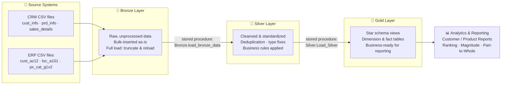
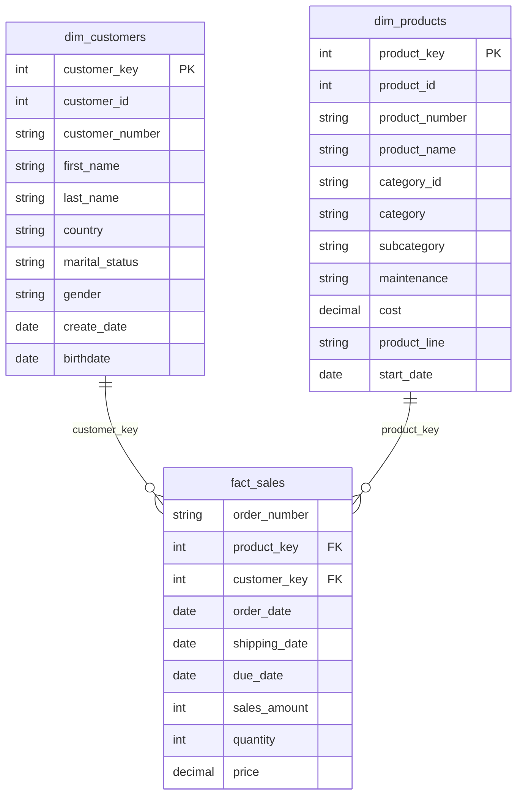

# 🏗️ SQL Data Warehouse & Analytics Project

A modern data warehouse built on **SQL Server**, following **Medallion Architecture** (Bronze → Silver → Gold) to turn raw CRM and ERP data into clean, business-ready analytics — from schema design and stored-procedure ETL through to a **Kimball-style star schema** and SQL-based reporting.


-informational)


---

## 📖 Overview

This project consolidates sales data from two independent source systems — a **CRM** system and an **ERP** system — into a single, analytics-ready data warehouse. The two sources disagree on formatting, contain duplicates, dirty dates, and missing values, and need to be reconciled into one consistent model before they're usable for reporting.

**What it demonstrates:**
- Designing and building a layered warehouse from scratch (raw ingestion → cleansing → business-ready model)
- Diagnosing and fixing real data quality issues (duplicate keys, invalid dates stored as text, inconsistent categorical values, sign/logic errors in sales figures)
- Modeling a **star schema** (fact + dimension tables) for analytical querying
- Writing production-style **stored procedures** to make the pipeline re-runnable end-to-end
- Using SQL for exploratory data analysis and business reporting (customer segmentation, product performance, ranking, and part-to-whole analysis)

---

## 🏛️ Architecture

Data flows through three layers, each with a specific job — raw retention, cleansing, and business consumption:



| Layer | Purpose | Load Method | Consumers |
|---|---|---|---|
| **Bronze** | Raw, as-received data from source CSVs | Full load (truncate + `BULK INSERT`) | Data Engineers |
| **Silver** | Cleaned, standardized, deduplicated, business rules applied | Full load via stored procedure | Data Analysts / Engineers |
| **Gold** | Star schema (fact + dimension views), ready for BI | Views over Silver | Analysts, BI tools, stakeholders |

---

## ⭐ Data Model (Gold Layer — Star Schema)



---

## 📁 Repository Structure

```
data-warehouse-project/
│
├── Datasets/                      # Source CSVs (CRM + ERP)
│
├── Documents/                     # Architecture & data model diagrams
│
├── Scripts/
│   ├── init_database.sql          # Creates the database + bronze/silver/gold schemas
│   │
│   ├── Bronze/
│   │   ├── DDL_Bronze.SQL         # Table definitions for the raw layer
│   │   └── Proc_load_Bronze.SQL   # Stored procedure: BULK INSERT from source CSVs
│   │
│   ├── Silver/
│   │   ├── ddl.silver.sql         # Table definitions for the cleansed layer
│   │   └── Proc_Load.silver.sql   # Stored procedure: cleansing, dedup, business rules
│   │
│   └── Gold/
│       ├── dd.gold.sql                    # Star schema views (dim_customers, dim_products, fact_sales)
│       ├── Data Analytics Project         # EDA: sales trends over time
│       ├── Magnitude Analysis             # Aggregate metrics by category/country/gender
│       ├── Ranking Analysis               # Top/bottom performers (products, customers)
│       ├── Part-to-whole analysis         # Category contribution to total sales
│       ├── Customer Report                # Consolidated customer KPI view (RFM-style)
│       └── Product Report                 # Consolidated product KPI view
│
├── Tests/                         # Data quality checks
├── LICENSE
└── README.md
```

---

## 🔧 What Each Layer Actually Does

### 🥉 Bronze — Raw Ingestion
- Tables mirror source structure exactly — no transformation, no assumptions
- `Bronze.load_bronze_data` stored procedure truncates and reloads all 6 source tables via `BULK INSERT` in a single call
- Acts as the single source of truth / audit trail for what was actually received

### 🥈 Silver — Cleansing & Standardization
The `Silver.Load_Silver` procedure applies targeted fixes discovered through data profiling, including:
- **Deduplication** — `ROW_NUMBER() OVER (PARTITION BY ... ORDER BY ...)` to keep only the most recent customer record per ID
- **Type correction** — order dates arrived as raw 8-digit text (`YYYYMMDD`) and needed validation + safe casting to `date`, with invalid values set to `NULL` rather than failing the load
- **Categorical standardization** — collapsing inconsistent codes (`'S'`, `'M'`, `'F'`, blanks, nulls) into clean, consistent business labels (`'Single'`, `'Married'`, `'Male'`, `'Female'`, `'n/a'`)
- **Business rule enforcement** — recalculating `sales_amount` where it didn't match `quantity × price`, and back-filling missing prices from sales/quantity
- **Cross-system key harmonization** — stripping prefixes (e.g. `'NAS'`) from ERP customer IDs so they join cleanly against CRM keys
- **Referential integrity fixes** — deriving product end-dates from the *next* record's start-date using window functions, since the source data didn't track this explicitly

### 🥇 Gold — Business-Ready Star Schema
- `gold.dim_customers`, `gold.dim_products`, and `gold.fact_sales` are implemented as **views**, not materialized tables — always reflecting the latest Silver data with zero extra maintenance
- Surrogate keys generated via `ROW_NUMBER()` to decouple the model from source-system IDs
- CRM is treated as the master source for conflicting fields (e.g. gender), falling back to ERP only when CRM data is missing
- Historical/inactive product records are filtered out of the dimension, keeping the model focused on current offerings

---

## 📊 Analytics Delivered on Top of the Warehouse

Once the star schema was in place, it was used to answer real business questions:

- **Trend analysis** — sales, customer count, and quantity by year and month
- **Magnitude analysis** — customers by country/gender, products by category, average costs
- **Ranking analysis** — top 5 revenue-generating products, best/worst performing customers
- **Part-to-whole analysis** — which product category contributes the most to overall revenue
- **Customer report** — segments customers into VIP / Regular / New, with recency, lifespan, and average order value
- **Product report** — segments products into High-Performer / Mid-Range / Low-Performer with recency and monthly revenue metrics

---

## 🛠️ Tech Stack

- **SQL Server Express** — database engine
- **T-SQL** — DDL, stored procedures, window functions, CTEs
- **VS Code** with the **MSSQL extension** — development environment
- **Git & GitHub** — version control

---

## ▶️ How to Run This Project

1. Clone the repository and place the source CSVs under `Datasets/` (matching the paths referenced in `Proc_load_Bronze.SQL`, or update the file paths to your local setup)
2. Run `Scripts/init_database.sql` to create the `Datawarehouse` database and the `Bronze`, `Silver`, and `Gold` schemas
3. Run `Scripts/Bronze/DDL_Bronze.SQL`, then execute `EXEC Bronze.load_bronze_data` to load raw data
4. Run `Scripts/Silver/ddl.silver.sql`, then execute `EXEC Silver.Load_Silver` to populate the cleansed layer
5. Run `Scripts/Gold/dd.gold.sql` to create the star schema views
6. Query the Gold layer directly, or run the scripts under `Scripts/Gold/` for pre-built analytics

---

## 🙏 Acknowledgments

The overall project structure and dataset were introduced through **[Baraa Khatib Salkini's free SQL Data Warehouse course](https://github.com/DataWithBaraa/sql-data-warehouse-project)**. Every script in this repository the schema design, the stored procedures, the data-quality fixes, and all analytics queries was written and debugged by me. Working through the errors along the way (type mismatches, join failures, invalid casts) is where most of the actual learning happened.

## 📄 License

This project is licensed under the [MIT License](LICENSE).

## 👤 About Me

I'm a final-year Economics student building toward a career in data analytics/engineering. This project is part of my hands-on SQL portfolio feel free to reach out if you'd like to connect.
